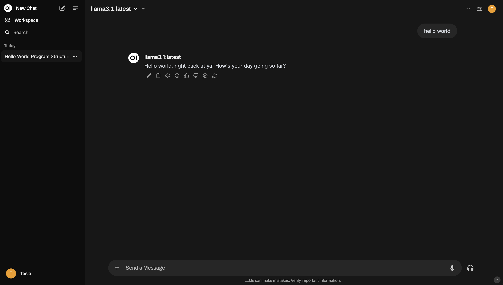
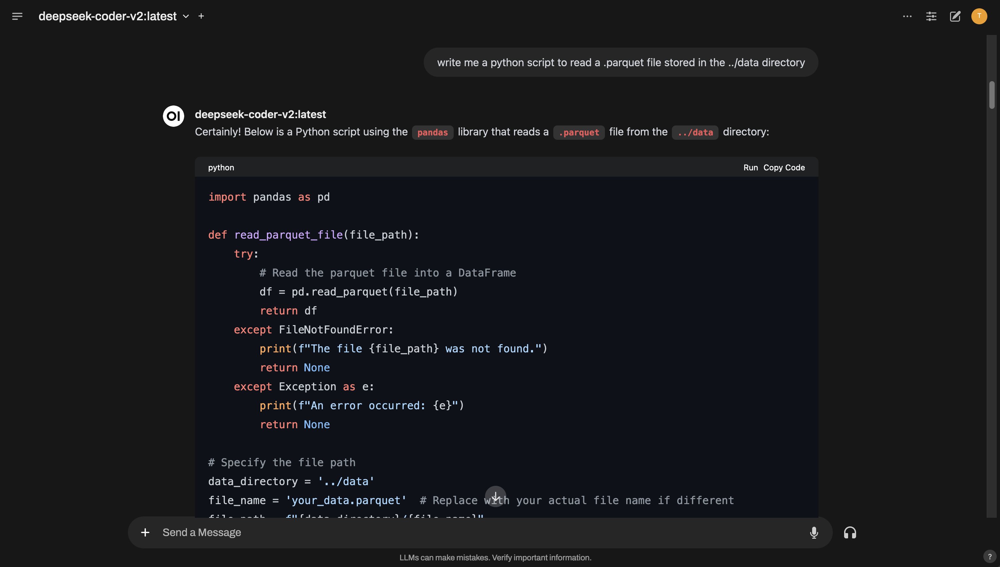

# Taxi Data Analysis with local LLMs
This repository showcases a personal project where I deploy a Large Language Model (LLM) locally using OpenWebUI to perform data analysis on the NYC Taxi dataset.



## Data Cleaning and Analysis
Data handling and analysis is divided into major parts. In the first part, we will begin by cleaning the data---getting rid of duplicates, null values, etc. This will be following by doing exploratory analysis to gain insights on the data. We will use `deepseek-coder-v2` 16B parameter model for the purposes of code generation. An example of how we can use it is the following: I asked it to generate me the python script for reading `.parquet` file 



### Data cleaning and main results

We start the cleaning process by looking at the correlation map between various parameters of the dataset. 


From the above plot, we notice that there are some parameters that do not have provide any additional information, like VendorID and store_and_fwd_flag. We will drop these. Next we found that there were zero duplicate entires. The number of zero values for passenger count is found to be 31465, trip duration were 60371 and total amount were 416. These values were dropped as clearly, there was some error in the data entry. After the deletion, we find:

Number of duplicate rows removed: 91177 \
Original DataFrame size in terms of rows: 2964624 \
Duplicated DataFrame size in terms of rows: 2873447 \
Reduction in the number of rows: 3.08% 

We drop all the data from the other years except 2024, as they contain only 15 entries in total. We also calculate trip duration by using the difference of the `tpep_dropoff_datetime` and `tpep_pickup_datetime` parameters and dropping the values which have zero difference. There were only 53 of these. 

We remove all the trips with negative fare value to avoid contamination. All the trips above the trip distance of 50 miles are removed due to inconsistent trip distance and trip fare (and the size of NYC is ca. 33 miles x 13 miles). 

### Data analysis and main results

The main objective of this analysis is to understand the taxi data to derive useful information like what are the most popular times/locations for people to catch a taxi, such that taxi drivers can remain active around that time/location to optimize their pickup strategy. Furthermore, we will perform regression analysis to predict repeatable patterns. 

The total trips by hour for each day in January is shown in the plot below. 

 

Wednesdays are the most popular days while Sundays are the least popular. The hours of 1600-1800 has the highest demand, surpassing even 0900-1100. Possible reason for Wednesday being more popular than Monday or Friday could be due to higher amount of scheduled meetings in the middle of the week and bars offering happy hours. The time frame of 1600-1800 fits well with the 9-5 office schedule, where everyone starts going home. A lesser demand in the morning can be possibly due to staggered work schedules and flexible office timings. The exact reasons for the most popular day and time remains unclear and more information will be required to deduce it. 

Next, we look at the heat map of number of taxi pickups. 

 

The borough with most amount of pickups is Manhattan and the rest of them are much lower. This can be explained due to the presence of many offices, employees and tourists in this region. The only other region with relatively higher pickup amount is the JFK Airport, which has to transport incoming passengers.  

The trip distance vs fare amount is shown below 

 

The relation between these two parameters is linear and expected. 


## Setup of local LLM
To easily download and manage LLMs locally, install Ollama on Mac, using the following 

```
brew install ollama
```
This will install the formula by default, which is what we need. To start it, run:

```
brew services start ollama
```

Check if it is running by executing:

```
ollama --version
```
To download a model, say llama 3.1, run: 

```
ollama pull llama3.1
```
This is will download the 8B parameter model. To run that model within your shell, run:

```
ollama run llama3.1
``` 
To stop it, simply type `/bye`. 

In order to have a web interface for using the LLM, we start by cloning the OpenWebUI repository: 
```
git clone https://github.com/open-webui/open-webui.git
```

The frontend is written in Javascript while the backend is written in Python. For the backend, I recommend using conda to setup a new environment by running:

```
conda create --name openwebui python=3.11 
```
Activate the environment by running:

```
conda activate openwebui
```

Then go to the backend folder within the openwebui repository and run:

```
pip install -r requirements.txt -U 
```

Next we node for which we use nvm to manage the node environment. Since the requirements for openwebui are node:>=18.13.0 <=21.x.x and npm:>=6.0.0, we use version 20 by simply running 

```
nvm install 20
```
Check the version by running: 

```
node --version
```

Next, go to the parent directory and run:

```
npm install 
```
and 
```
npm run build
```

Then go back to the backend subdirectory and run 
```
bash start.sh 
```

Now we are ready to run the LLM on a web interface. To access it, open the browser of your choice and go to `localhost:8080/auth/` and you will be prompted to sign up there. The credentials stay local so you can enter whatever you want. The web interface allows you to download models, select a model and chat with it. You can also turn on the ability to browse the web by turning it on in the admin settings. 
